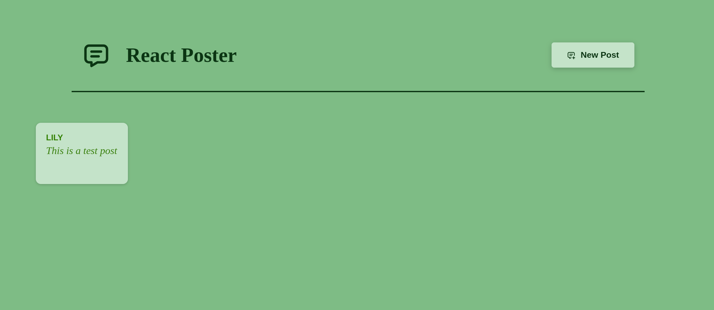

# React + Vite
* This is a post-project developed with React.js,
* Allow us to create posts with names and simple text,
* You can use it with the post-dummy-backend.
    * download this project, go to the folder:
    ```
    npm init
    npm run dev
    ```
    * download post-dummy-backend, go to the folder:
    ```
    npm init
    npm start
    ```
**Below are the screenshots of the project**
* When there has no post yet

* Add a new post

* Loading post

* display post



